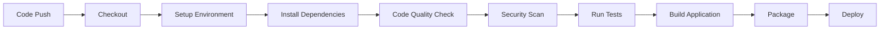

# 🐛 Zero-Touch Code Analyzer

> **AI-Powered Multi-Language Bug Detection & Code Quality Analysis**

[](https://opensource.org/licenses/MIT)
[](https://www.python.org/downloads/)
[](https://flask.palletsprojects.com/)
[](https://github.com)

Zero-Touch Code Analyzer is a professional web application that automatically detects bugs, security vulnerabilities, and code quality issues in your code. It supports **Python, C, C++, Java, and JavaScript** with intelligent suggestions for fixing detected issues.


---

## 📋 Table of Contents

- [Features](#-features)
- [Demo](#-demo)
- [Tech Stack](#-tech-stack)
- [Installation](#-installation)
- [Usage](#-usage)
- [CI/CD Pipeline](#-cicd-pipeline)
- [Project Structure](#-project-structure)
- [API Documentation](#-api-documentation)
- [Supported Languages](#-supported-languages)
- [Deployment](#-deployment)
- [Contributing](#-contributing)
- [License](#-license)
- [Contact](#-contact)

---

## ✨ Features

### 🔍 **Intelligent Bug Detection**
- Automatic syntax error detection
- Runtime bug identification
- Logic error analysis
- Memory leak detection (C/C++)

### 🛡️ **Security Analysis**
- Buffer overflow detection
- SQL injection risk identification
- Unsafe function usage warnings
- Security best practice recommendations

### 💡 **Smart Suggestions**
- Actionable fix recommendations
- Best practice guidance
- Code quality improvements
- Modern language feature suggestions

### 🌐 **Multi-Language Support**
- **Python** - AST analysis + Pylint integration
- **C** - Memory management & security checks
- **C++** - Modern C++ practices & RAII
- **Java** - Best practices & common pitfalls
- **JavaScript** - ES6+ recommendations

### 📊 **Quality Scoring**
- Code quality score (0-100)
- Issue severity classification
- Detailed analysis reports
- Line-by-line issue tracking

### 🚀 **Professional Features**
- Modern, responsive UI
- Real-time analysis
- Syntax highlighting
- Sample code examples
- Export analysis results

---

## 🎬 Demo

### Live Demo
🔗 **[Try it live on Render](https://your-app-name.onrender.com)** *(Replace with your actual URL)*

### Quick Start
```bash
# Clone the repository
git clone https://github.com/yourusername/zero-touch-analyzer.git

# Navigate to project directory
cd zero-touch-analyzer

# Install dependencies
pip install -r requirements.txt

# Run the application
python app.py

# Open in browser
# http://localhost:5000
```

---

## 🛠️ Tech Stack

### Backend
- **Flask 3.0.0** - Web framework
- **Python 3.11** - Programming language
- **Pylint 3.0.3** - Python code analysis
- **Gunicorn 21.2.0** - Production server

### Frontend
- **HTML5 & CSS3** - Structure and styling
- **JavaScript (ES6+)** - Interactivity
- **Font Awesome** - Icons
- **Google Fonts (Inter)** - Typography

### DevOps & CI/CD
- **Jenkins** - Continuous integration
- **GitHub Actions** - Automated workflows
- **Git & GitHub** - Version control
- **Render** - Cloud deployment

### Code Analysis Tools
- **AST (Abstract Syntax Tree)** - Python parsing
- **Pylint** - Python code quality
- **Pattern Matching** - C/C++/Java/JS analysis
- **Security Scanners** - Vulnerability detection

---

## 📥 Installation

### Prerequisites
- Python 3.11 or higher
- pip (Python package manager)
- Git
- Modern web browser

### Step 1: Clone Repository
```bash
git clone https://github.com/yourusername/zero-touch-analyzer.git
cd zero-touch-analyzer
```

### Step 2: Create Virtual Environment (Recommended)
```bash
# Windows
python -m venv venv
venv\Scripts\activate

# macOS/Linux
python3 -m venv venv
source venv/bin/activate
```

### Step 3: Install Dependencies
```bash
pip install -r requirements.txt
```

### Step 4: Run Application
```bash
python app.py
```

### Step 5: Access Application
Open your browser and navigate to:
```
http://localhost:5000
```

---

## 🎯 Usage

### Web Interface

1. **Select Language**
   - Choose from Python, C, C++, Java, or JavaScript

2. **Enter Code**
   - Paste your code in the editor
   - Or use the provided sample code

3. **Analyze**
   - Click "Analyze Code" button
   - Wait for real-time analysis

4. **Review Results**
   - Check quality score
   - Review bugs and warnings
   - Read fix suggestions

### API Usage

#### Analyze Code Endpoint
```bash
POST /api/analyze
Content-Type: application/json

{
  "code": "your code here",
  "language": "python"
}
```

#### Example using cURL
```bash
curl -X POST http://localhost:5000/api/analyze \
  -H "Content-Type: application/json" \
  -d '{
    "code": "print(\"Hello World\")",
    "language": "python"
  }'
```

#### Example Response
```json
{
  "language": "Python",
  "score": 95,
  "bugs": [],
  "warnings": [
    {
      "type": "Debug Code",
      "line": 1,
      "message": "Print statement found",
      "suggestion": "Use logging instead of print"
    }
  ],
  "suggestions": [],
  "metadata": {
    "language": "python",
    "lines_of_code": 1,
    "characters": 20
  }
}
```

---

## 🔄 CI/CD Pipeline

### Pipeline Stages


### Jenkins Pipeline

The project includes a complete Jenkins pipeline with:

1. **Checkout** - Get code from GitHub
2. **Setup Environment** - Create Python virtual environment
3. **Install Dependencies** - Install required packages
4. **Code Quality Check** - Run Pylint
5. **Security Scan** - Check vulnerabilities
6. **Run Tests** - Test all analyzers
7. **Build Application** - Prepare deployment
8. **Package Application** - Create archive
9. **Deploy** - Deploy to staging/production

### GitHub Actions

Automated workflow triggered on:
- Push to `main` or `develop` branch
- Pull requests to `main` or `develop`

**Features:**
- Dependency caching
- Parallel testing
- Artifact upload
- Automatic deployment to Render (main branch only)

---

## 📁 Project Structure
```
zero-touch-analyzer/
│
├── app.py                      # Main Flask application
├── requirements.txt            # Python dependencies
├── runtime.txt                # Python version for deployment
├── render.yaml                # Render deployment config
├── Jenkinsfile                # Jenkins CI/CD pipeline
├── LICENSE                    # MIT License
├── README.md                  # Project documentation
│
├── .github/
│   └── workflows/
│       └── ci-cd.yml          # GitHub Actions workflow
│
├── static/                    # Frontend static files
│   ├── css/
│   │   └── style.css         # Main stylesheet
│   ├── js/
│   │   └── main.js           # JavaScript logic
│   └── images/               # Images and icons
│
├── templates/                 # HTML templates
│   └── index.html            # Main page
│
└── analyzers/                # Code analysis modules
    ├── __init__.py
    ├── python_analyzer.py    # Python code analyzer
    ├── c_analyzer.py         # C code analyzer
    ├── cpp_analyzer.py       # C++ code analyzer
    ├── java_analyzer.py      # Java code analyzer
    └── javascript_analyzer.py # JavaScript code analyzer
```

---

## 📚 API Documentation

### Base URL
```
http://localhost:5000/api
```

### Endpoints

#### 1. Health Check
```http
GET /api/health
```

**Response:**
```json
{
  "status": "healthy",
  "message": "Zero-Touch Code Analyzer is running",
  "supported_languages": ["python", "c", "cpp", "java", "javascript"]
}
```

#### 2. Get Supported Languages
```http
GET /api/languages
```

**Response:**
```json
{
  "languages": [
    {"value": "python", "label": "Python"},
    {"value": "c", "label": "C"},
    {"value": "cpp", "label": "C++"},
    {"value": "java", "label": "Java"},
    {"value": "javascript", "label": "JavaScript"}
  ]
}
```

#### 3. Analyze Code
```http
POST /api/analyze
Content-Type: application/json
```

**Request Body:**
```json
{
  "code": "string (required)",
  "language": "string (required: python|c|cpp|java|javascript)"
}
```

**Response:**
```json
{
  "language": "string",
  "score": "number (0-100)",
  "bugs": [
    {
      "type": "string",
      "line": "number",
      "message": "string",
      "suggestion": "string"
    }
  ],
  "warnings": [...],
  "suggestions": [...],
  "metadata": {
    "language": "string",
    "lines_of_code": "number",
    "characters": "number"
  }
}
```

---

## 🌍 Supported Languages

### Python
- **Analyzer:** Pylint + AST
- **Features:**
  - Syntax validation
  - Undefined variables
  - Import errors
  - Code style issues
  - Unused variables

### C
- **Analyzer:** Pattern matching + Security checks
- **Features:**
  - Memory leak detection
  - Buffer overflow warnings
  - Unbalanced braces
  - Missing semicolons
  - Dangerous functions (gets, strcpy)

### C++
- **Analyzer:** Modern C++ practices
- **Features:**
  - Memory management (new/delete)
  - Smart pointer suggestions
  - Namespace usage
  - Include guards
  - C-style cast detection

### Java
- **Analyzer:** Best practices + Common pitfalls
- **Features:**
  - String comparison (== vs .equals)
  - Null pointer warnings
  - Raw types detection
  - Naming conventions
  - Exception handling

### JavaScript
- **Analyzer:** ES6+ recommendations
- **Features:**
  - Strict equality (=== vs ==)
  - var vs let/const
  - Promise error handling
  - Console statements
  - Modern syntax suggestions

---

## 🚀 Deployment

### Deploy to Render

1. **Create Render Account**
   - Sign up at [render.com](https://render.com)

2. **Connect GitHub Repository**
   - Link your GitHub account
   - Select the repository

3. **Configure Service**
   - **Type:** Web Service
   - **Build Command:** `pip install -r requirements.txt`
   - **Start Command:** `gunicorn app:app`
   - **Environment:** Python 3

4. **Deploy**
   - Click "Create Web Service"
   - Render will automatically build and deploy

5. **Access Your App**
   - Your app will be live at: `https://your-app-name.onrender.com`

### Environment Variables (Optional)
```env
PYTHON_VERSION=3.11.0
PORT=5000
```

---

## 🤝 Contributing

Contributions are welcome! Here's how you can help:

### Steps to Contribute

1. **Fork the Repository**
```bash
   git clone https://github.com/yourusername/zero-touch-analyzer.git
```

2. **Create a Branch**
```bash
   git checkout -b feature/your-feature-name
```

3. **Make Changes**
   - Add your improvements
   - Test thoroughly

4. **Commit Changes**
```bash
   git add .
   git commit -m "Add: your feature description"
```

5. **Push to GitHub**
```bash
   git push origin feature/your-feature-name
```

6. **Create Pull Request**
   - Go to GitHub
   - Create a pull request to `main` branch

### Contribution Ideas
- Add support for more languages (Go, Rust, TypeScript, etc.)
- Improve analyzer accuracy
- Add more security checks
- Enhance UI/UX
- Write comprehensive tests
- Improve documentation

---

## 📄 License

This project is licensed under the **MIT License** - see the [LICENSE](LICENSE) file for details.
```
MIT License

Copyright (c) 2026 MAHALAKSHMI K

Permission is hereby granted, free of charge, to any person obtaining a copy
of this software and associated documentation files (the "Software"), to deal
in the Software without restriction, including without limitation the rights
to use, copy, modify, merge, publish, distribute, sublicense, and/or sell
copies of the Software...
```

---

## 📞 Contact

**Project Maintainer:** [Your Name]

- **GitHub:** [@yourusername](https://github.com/yourusername)
- **Email:** your.email@example.com
- **LinkedIn:** [Your LinkedIn](https://linkedin.com/in/yourprofile)

---

## 🙏 Acknowledgments

- **Flask** - Web framework
- **Pylint** - Python code analysis
- **Font Awesome** - Icons
- **Render** - Hosting platform
- **Jenkins** - CI/CD automation
- **GitHub Actions** - Workflow automation

---

## 📈 Roadmap

### Version 1.1 (Upcoming)
- [ ] Add more programming languages (Go, Rust, TypeScript)
- [ ] Implement user authentication
- [ ] Add code history and saved analyses
- [ ] Export reports to PDF
- [ ] API rate limiting

### Version 2.0 (Future)
- [ ] AI-powered code suggestions using LLMs
- [ ] Real-time collaborative code review
- [ ] Integration with GitHub/GitLab
- [ ] Mobile app version
- [ ] Advanced analytics dashboard

---

## 🌟 Star History

If you find this project useful, please consider giving it a ⭐ on GitHub!

[](https://star-history.com/#yourusername/zero-touch-analyzer&Date)

---

## 📊 Statistics


---

<div align="center">

**Made with ❤️ for developers by developers**

[⬆ Back to Top](#-zero-touch-code-analyzer)

</div>
